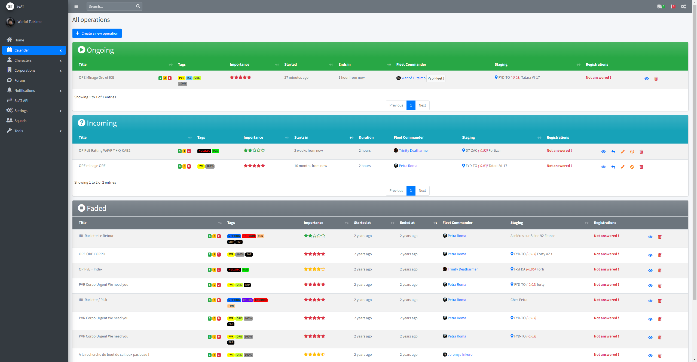
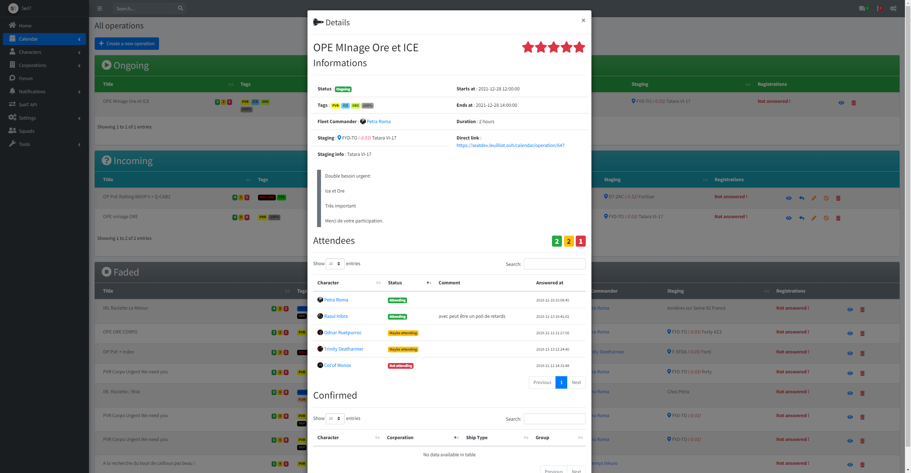
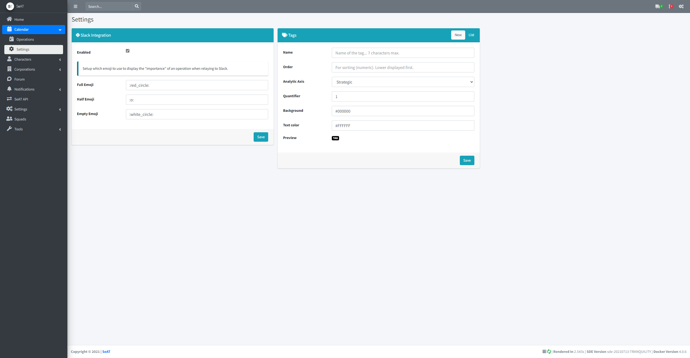
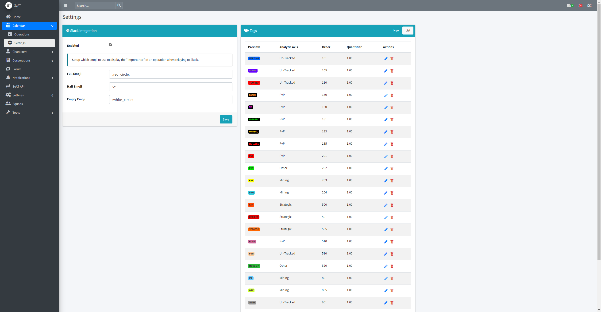

# eveseat-calendar

Calendar plugin for EVE SeAT

# Features

* Create/Update/Cancel/Delete/Close & Tag operations
* Register to operations
* Slack integration
* Permissions

# Release

https://packagist.org/packages/kassie/calendar

# Compatibility

| SeAT Core | Calendar | Branch                                                           |
| --------- | -------- | ---------------------------------------------------------------- |
| 2.x       | 1.x      | [2.0.x](https://github.com/BenHUET/eveseat-calendar/tree/2.0.x)  |
| 3.x       | 3.x      | [3.0.x](https://github.com/BenHUET/eveseat-calendar/tree/3.0.x)  |
| 4.x       | 4.x      | [master](https://github.com/BenHUET/eveseat-calendar)            |

# Installation

* `composer require kassie/calendar` in the SeAT root directory
* `php artisan vendor:publish --force`
* `php artisan migrate`
* `php artisan db:seed --class=Seat\\Kassie\\Calendar\\database\\seeds\\CalendarSettingsTableSeeder`
* `php artisan db:seed --class=Seat\\Kassie\\Calendar\\database\\seeds\\CalendarTagsSeeder`
* `php artisan db:seed --class=Seat\\Kassie\\Calendar\\database\\seeds\\ScheduleSeeder`

## Since 1.3.2

Since 1.3.2, the PAP mechanism has been implemented. You need `esi-fleets.read_fleet.v1` into your requested scopes list.

# Feedbacks or support

@kassie_yvo on eve-seat.slack.com  
kassie.yvo@gmail.com  
Kassie Yvo in-game  

If you like this module, consider giving some ISK, I'm space poor.

# Screenshots

## Main display  

## Details of an operation

## Customize your tags

## Slack integration

## Pap feature

